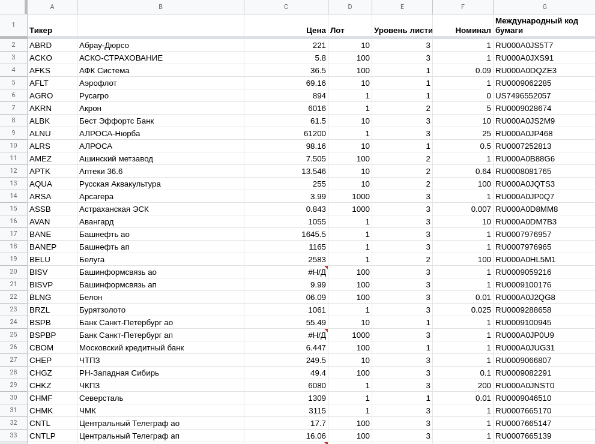

# MOEX Info Bot

Телеграм-бот для для получения информации по акциям компаний российского фондового рынкапо их тикеру или названию 📈  
Написан на Node.js с использованием Telegram API и Google API.  
Информация об акциях компаний парсится в Гугл-таблицы и оттуда выдается ботом по запросу. 
Задеплоен на Heroku.

Таблица, в которую парсятся данные:

